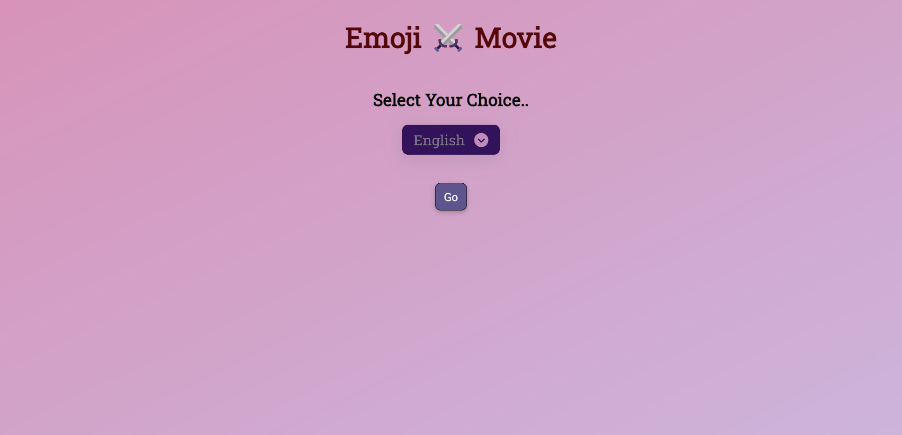

# Emoji To Movie

#### Description:

This Project is a game that tests your knowledge of movies by asking you to guess the movie title based on a series of emojis. The game is played in multiple pages. On the first page, you can select the language you want to play in (English or Hindi).

.png)

The default language is English. Once you have selected a language, click on "Go" to load the game.

The game will then show you a series of emojis. Your task is to guess the movie title that the emojis represent. To do this, click on the answer that you think is correct. If you answer correctly, the color will turn green. If you answer incorrectly, the color will turn red.

.png)

For each correct answer, you will earn 3 points. For each incorrect answer, you will lose 1 point (minimun score is 0). The game will track your progress and show you how many questions you have answered correctly.

The game has a total of 15 questions. Once you have answered all of the questions, the game will display your final score. You can also see your progress by checking the "Score" option. It will show the Number of points you earned.

.png)

#### Features:

- Test your knowledge of movies by guessing the movie title based on a series of emojis.
- Choose from English or Hindi language.
- 15 questions to test your skills.
- Track your progress and see how many questions you have answered correctly.
- Earn points for each correct answer and lose points for each incorrect answer.
- See your final score at the end of the game.

#### How to play:
    
  - Select the language you want to play in.
  - Click on "Go" to load the game.
  - Watch the emojis and guess the movie title.
  - Click on the answer that you think is correct then submit the answer.
  - Repeat steps 3-4 until you have answered all of the questions.
  - Your final score will be displayed at the end of the game.
  

## Demo

Watch the demo video on [YouTube](https://youtu.be/8iAmm52f8MY).

## Tech Stack

**Front End :** HTML, CSS, JavaScript

**IDE:** Visual Studio Code

